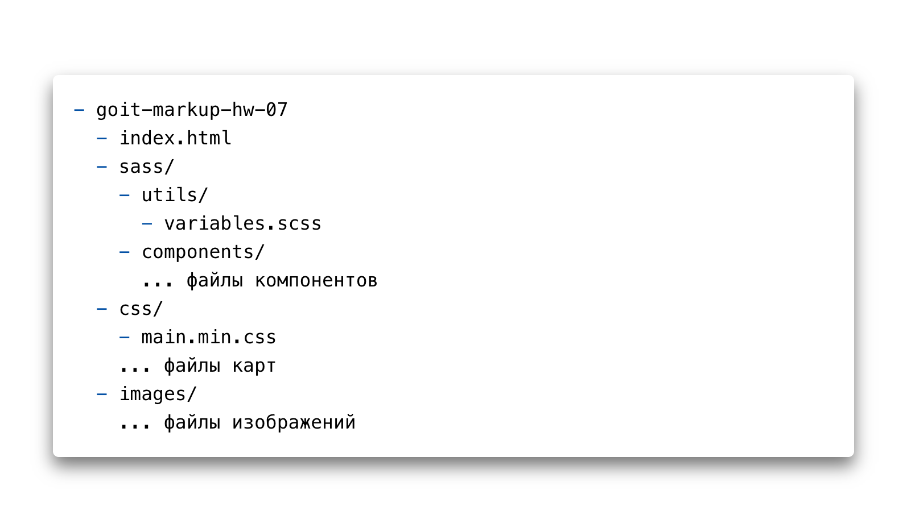

# goit-markup-hw-07

# Homework-7-bem-sass

- Створи репозиторій `goit-markup-hw-07`.
- Склонуй створений репозиторій і скопіюй в нього файли попередньої роботи.
- Налаштуй `GitHub Pages` і додай посилання на живу сторінку в шапку GitHub-репозиторія.

## Структура файлів проекту

## Критерії приймання роботи наставником

## Проект

**`«A1»`** Виконано рефакторинг HTML-коду проекту, використовуючи методологію BEM. - **`DONE`**

**`«A2»`** Виконано рефакторинг CSS-коду проекту, використовуючи препроцесор `SASS`. - **`DONE`**

**`«A3»`** У корені проекту створена папка `sass`, в якій лежать всі файли стилів препроцесора. -
**`DONE`**

**`«A4»`** В папці `sass` є файл `main.scss` - головний файл, в який імпортуються всі SASS-фрагменти
(partials, файли `_имя.scss`). - **`DONE`**

**`«A5»`** Палітра кольорів макета і набори шрифтів винесені у змінні у файлі `variables.scss`, який
лежить в папці `sass/utils`. Можна використовувати CSS або SASS змінні (за бажанням). - **`DONE`**

**`«A6»`** Для кожного компонента створений окремий файл-фрагмент стилів у папці `sass/components`.
Наприклад `_page-header.scss`, `_logo.scss` тощо. - **`DONE`**

**`«A7»`** У файлах `index.html` і `portfolio.html` підключений мініфікованний файл стилів
`main.min.css` з папки `css`. - **`DONE`**

## Розмітка (без сторінки portfolio)

**`«B1»`** Правильне іменування класів блоків за методологією BEM. - **`DONE`**

**`«B2»`** Правильне іменування класів елементів за методологією BEM. - **`DONE`**

**`«B3»`** Правильне іменування класів модифікаторів за методологією BEM. - **`DONE`**

**`«B4»`** Правильне іменування класів міксінів за методологією BEM. - **`DONE`**

**`«B5»`** Імена класів за методологією BEM зрозумілі і описові, англійською мовою. - **`DONE`**

## Оформлення

**`«C1»`** Використана вкладеність селекторів. - **`DONE`**

**`«C2»`** Максимальна вкладеність селекторів - 2 рівня. - **`DONE`**

**`«C3»`** Оператор конкатенації (`&`) використаний для опису псевдокласів і псевдоелементів. -
**`DONE`**
